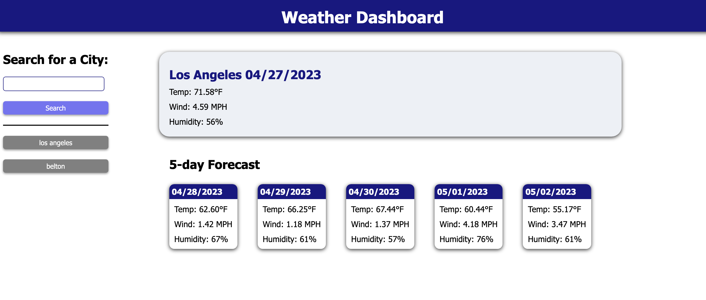

# weather-dashboard

## Description

This app takes a city name as input and then displays the current weather and a five-day forecast for that city. It is done via a call to the OpenWeather API.

Previous searches appear as buttons that can be clicked to search that city again.

Link to application: [https://jboyce313.github.io/weather-dashboard/](https://jboyce313.github.io/weather-dashboard/)

Link to OpenWeather: [https://openweathermap.org/](https://openweathermap.org/)
